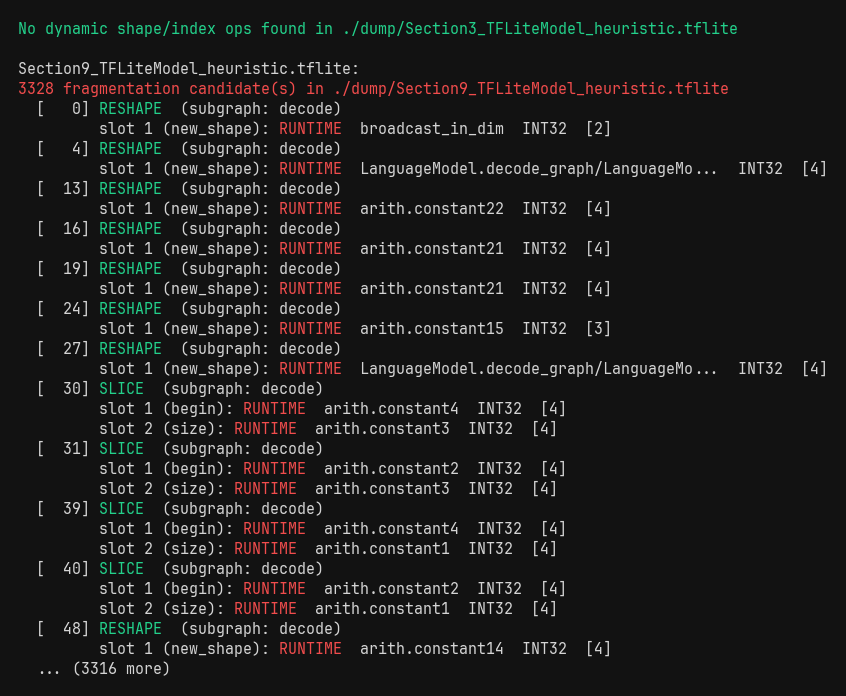

# tinygraphparser

Parse TFLite / LiteRT-LM graphs and statically predict QNN delegate partitioning (NPU vs CPU).

## Setup

```
uv sync
uv run python examples/main.py
```

## Extract

Heuristic TFL3 magic scan over a `.litertlm` file. Writes each embedded blob to `out_dir`.

```python
from tinygraphparser import LiteRTLMExtractor

tflite_files = LiteRTLMExtractor.extract("model.litertlm", "./dump")
# ["./dump/Section1_TFLiteModel_heuristic.tflite", ...]
```


## Parse

Reads a `.tflite` flatbuffer. Input tensors carry constness and decoded INT32 values.

```python
from tinygraphparser import TFLiteGraphParser

graph = TFLiteGraphParser().parse(tflite_files[2])
# graph["subgraphs"][0]["ops"][0]["inputs"][1]["is_constant"]  -> True
# graph["subgraphs"][0]["ops"][0]["inputs"][1]["const_values"] -> [1, 128, 42]
```

Graph shape:
```python
{
  "path": str,
  "subgraphs": [{
    "name": str,
    "ops": [{
      "index":   int,
      "opname":  str,
      "inputs":  [{"name": str, "dtype": str, "shape": list,
                   "is_constant": bool, "const_values": list | None,
                   "tensor_index": int}],
      "outputs": [{"name": str, "dtype": str, "shape": list,
                   "tensor_index": int}],
    }]
  }]
}
```


## Op histogram

Op counts sorted descending, split by output dtype. Surfaces mixed-precision hotspots.

```python
from tinygraphparser import report_op_histogram

report_op_histogram(graph)
report_op_histogram(graph, top=10)
```


## Dynamic shape detection

Flags ops whose shape/index inputs are runtime tensors or contain `-1`. These cause partition splits.

```python
from tinygraphparser import report_dynamic_shape_ops

report_dynamic_shape_ops(graph)
```

Checked ops: `RESHAPE`, `PAD`, `PADV2`, `MIRROR_PAD`, `STRIDED_SLICE`, `SLICE`, `GATHER`, `GATHER_ND`, `SCATTER_ND`, `BROADCAST_TO`, `TILE`, `TRANSPOSE`, `RESIZE_BILINEAR`, `RESIZE_NEAREST_NEIGHBOR`

Two reasons reported: `runtime` (no buffer) · `inferred_dim` (constant but contains `-1`, RESHAPE only)



## Partition simulation

Classifies each op as NPU-eligible (has a QNN builder and no dynamic shape inputs) and groups contiguous runs. Largest NPU partition is the headline health metric — one large partition means one delegate dispatch.

```python
from tinygraphparser import load_op_support, simulate_partition, report_partitions

op_support = load_op_support("analysis/opSupportMap.csv")
partitions = simulate_partition(graph, op_support)
report_partitions(partitions)
```

CPU fallback reasons: `no_builder` · `dynamic_shape` · `unsupported_composite`


## Seam dump

Prints context ops around each CPU partition boundary. Use this to diagnose exactly what caused a split.

```python
from tinygraphparser import report_seams

report_seams(graph, partitions, context=2, kind="CPU")
```


## Predicted vs actual

Diff the simulator against real `apply_plugin_main` output. `divergent_ops` (predicted NPU, actually CPU) is the interesting class — points to dtype/shape constraints not captured in `opSupportMap.csv`.

```python
from tinygraphparser import compare_to_actual, report_comparison

actual = {
    "main": {
        "npu_partitions": 4,
        "cpu_partitions": 3,
        "cpu_op_indices": [488, 891, 1450],
    }
}
diffs = compare_to_actual(partitions, actual)
report_comparison(diffs)
```


